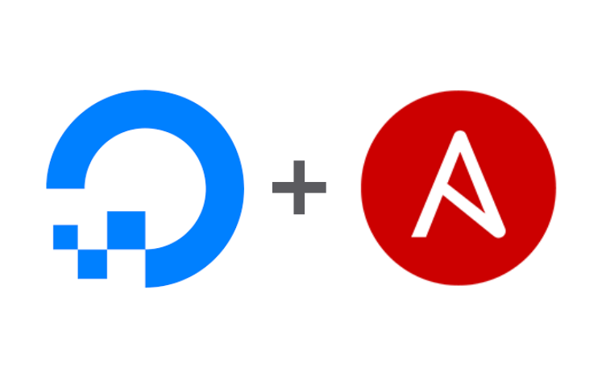

# DigitalOcean Collection

<p align="left" width="100%">

</p>

This repository contains the [`digitalocean.cloud`](https://galaxy.ansible.com/digitalocean/cloud) Ansible Collection.
This is a grounds-up rewrite of the [`community.digitalocean`](https://galaxy.ansible.com/community/digitalocean) Ansible collection, leveraging [PyDO](https://github.com/digitalocean/pydo).

## DigitalOcean Collection for Ansible

[](https://galaxy.ansible.com/digitalocean/cloud)
[](https://github.com/digitalocean/ansible-collection/releases)
[](https://www.bestpractices.dev/projects/7862)

[](https://github.com/digitalocean/ansible-collection/actions/workflows/ansible-test-integration.yml)
[](https://github.com/digitalocean/ansible-collection/actions/workflows/ansible-test-sanity.yml)
[](https://github.com/digitalocean/ansible-collection/actions/workflows/ansible-test-unit.yml)
[](https://github.com/digitalocean/ansible-collection/actions/workflows/publish-galaxy.yml)
[](https://github.com/digitalocean/ansible-collection/actions/workflows/extra-docs-linting.yml)
[](https://github.com/digitalocean/ansible-collection/actions/workflows/psf-black.yml)

[](https://codespaces.new/digitalocean/ansible-collection?quickstart=1)

This collection can be used to manage infrastructure in the [DigitalOcean](https://www.digitalocean.com/) cloud.
The DigitalOcean API documentation is located [here](https://docs.digitalocean.com/reference/api/api-reference/).
The pydo library which this collection is based on is hosted on [GitHub](https://github.com/digitalocean/pydo) and [PyPI](https://pypi.org/project/pydo/).

## Code of Conduct

We follow the [Ansible Code of Conduct](https://docs.ansible.com/ansible/devel/community/code_of_conduct.html) in all our interactions within this project.

If you encounter abusive behavior, please refer to the [policy violations](https://docs.ansible.com/ansible/devel/community/code_of_conduct.html#policy-violations) section of the Code for information on how to raise a complaint.

## Communication

Join us in [Libera.chat](https://libera.chat/) in the `#ansible-digitalocean` for collection development questions or DigitalOcean Community Discord in the [`#ansible`](https://discord.com/channels/707751027973161132/1069237079642476604) channel.

## Contributing to this collection

<!--Describe how the community can contribute to your collection. At a minimum, fill up and include the CONTRIBUTING.md file containing how and where users can create issues to report problems or request features for this collection. List contribution requirements, including preferred workflows and necessary testing, so you can benefit from community PRs. If you are following general Ansible contributor guidelines, you can link to - [Ansible Community Guide](https://docs.ansible.com/ansible/devel/community/index.html). List the current maintainers (contributors with write or higher access to the repository). The following can be included:-->

The content of this collection is made by people like you, a community of individuals collaborating on making the world better through developing automation software.

We are actively accepting new contributors.

Any kind of contribution is very welcome.

You don't know how to start? Refer to our [contribution guide](CONTRIBUTING.md)!

We use the following guidelines:

- [CONTRIBUTING.md](CONTRIBUTING.md)
- [REVIEW_CHECKLIST.md](REVIEW_CHECKLIST.md)
- [Ansible Community Guide](https://docs.ansible.com/ansible/latest/community/index.html)
- [Ansible Development Guide](https://docs.ansible.com/ansible/devel/dev_guide/index.html)
- [Ansible Collection Development Guide](https://docs.ansible.com/ansible/devel/dev_guide/developing_collections.html#contributing-to-collections)

## Collection maintenance

The current maintainers are listed in the [MAINTAINERS](MAINTAINERS) file.
If you have questions or need help, feel free to mention them in the proposals.

To learn how to maintain / become a maintainer of this collection, refer to the [Maintainer guidelines](MAINTAINING.md).

## Governance

The process of decision making in this collection is based on discussing and finding consensus among participants.

Every voice is important. If you have something on your mind, create an issue or dedicated discussion and let's discuss it!

## Tested with versions

| Ansible       | Python |
| ------------- | ------ |
| `stable-2.13` | `3.9`  |
| `stable-2.14` | `3.9`  |
| `stable-2.15` | `3.10` |
| `devel`       | `3.10` |

## External requirements

```text
azure-core==1.26.1
pydo==0.1.4
```

The following should install the requirements for your account:

```shell
pip3 install --user azure-core==1.26.1 pydo==0.1.4
```

There is a [pyproject.toml](./pyproject.toml) is the root of this repository as well if you use [Poetry](https://python-poetry.org/) or similar.

## Included content

| Module                                              | Description                                  |
| --------------------------------------------------- | -------------------------------------------- |
| `digitalocean.cloud.account_info`                   | Get account information                      |
| `digitalocean.cloud.balance_info`                   | Get balance information                      |
| `digitalocean.cloud.billing_history_info`           | Get billing history                          |
| `digitalocean.cloud.cdn_endpoints_info`             | Get CDN endpoints                            |
| `digitalocean.cloud.certificate`                    | Create and delete certificates               |
| `digitalocean.cloud.certificate_info`               | Get certificates                             |
| `digitalocean.cloud.database_cluster_info`          | Get databases                                |
| `digitalocean.cloud.domain`                         | Create and delete domains                    |
| `digitalocean.cloud.domain_record`                  | Create and delete domain records             |
| `digitalocean.cloud.domain_records_info`            | Get domain records                           |
| `digitalocean.cloud.domains_info`                   | Get domains                                  |
| `digitalocean.cloud.droplet`                        | Create and delete Droplets                   |
| `digitalocean.cloud.droplet_action_power`           | Change power states on Droplets              |
| `digitalocean.cloud.droplet_action_resize`          | Resize Droplets                              |
| `digitalocean.cloud.droplet_action_snapshot`        | Snapshot Droplets                            |
| `digitalocean.cloud.droplets_info`                  | Get Droplets                                 |
| `digitalocean.cloud.firewall`                       | Create and delete firewalls                  |
| `digitalocean.cloud.firewall_info`                  | Get firewalls                                |
| `digitalocean.cloud.images_info`                    | Get images                                   |
| `digitalocean.cloud.kubernetes_cluster`             | Create and delete Kubernetes clusters        |
| `digitalocean.cloud.kubernetes_cluster_info`        | Get Kubernetes clusters                      |
| `digitalocean.cloud.load_balancer`                  | Create and delete load balancers             |
| `digitalocean.cloud.load_balancer_info`             | Get load balancers                           |
| `digitalocean.cloud.monitoring_alert_policies_info` | Get monitoring alert policies                |
| `digitalocean.cloud.monitoring_alert_policy`        | Create and deelete monitoring alert policies |
| `digitalocean.cloud.one_clicks_info`                | Get 1-Clicks                                 |
| `digitalocean.cloud.projects_info`                  | Get projects                                 |
| `digitalocean.cloud.regions_info`                   | Get regions                                  |
| `digitalocean.cloud.reserved_ip`                    | Create and delete reserved IP                |
| `digitalocean.cloud.reserved_ips_info`              | Get reserved IPs                             |
| `digitalocean.cloud.sizes_info`                     | Get sizes                                    |
| `digitalocean.cloud.snapshot`                       | Create and delete snapshots                  |
| `digitalocean.cloud.snapshots_info`                 | Get snapshots                                |
| `digitalocean.cloud.spaces_info`                    | Get Spaces                                   |
| `digitalocean.cloud.ssh_key`                        | Create and delete SSH keys                   |
| `digitalocean.cloud.ssh_keys_info`                  | Get SSH keys                                 |
| `digitalocean.cloud.tag`                            | Create and delete tags                       |
| `digitalocean.cloud.tags_info`                      | Get tags                                     |
| `digitalocean.cloud.volume`                         | Create and delete volumes                    |
| `digitalocean.cloud.volume_action`                  | Create and delete volume actions             |
| `digitalocean.cloud.volume_snapshot`                | Create and delete volume snapshots           |
| `digitalocean.cloud.volumes_info`                   | Get volumes                                  |
| `digitalocean.cloud.vpc`                            | Create and delete VPCs                       |
| `digitalocean.cloud.vpcs_info`                      | Get VPCs                                     |

| Inventory Plugin              | Description                       |
| ----------------------------- | --------------------------------- |
| `digitalocean.cloud.droplets` | Droplets dynamic inventory plugin |

## Using this collection

There are sample playbooks in the [playbooks](./playbooks) directory.
While we may not always have complete coverage of example playbooks, it is the expectation that there is complete module documentation (with `EXAMPLES`) and [integration test coverage](./tests/integration/targets/) for every module in the collection which exercise CRUD (create, read, update if applicable, and delete).

Be sure to set the `$DIGITALOCEAN_TOKEN` environment variable as most modules require authentication.
This is preferable in contrast to using the `token` module parameter in the play and storing your API token in plaintext within your playbook.
Modules which create, update, or destroy resources in the cloud will require an API token with "Write" permission.
Please read [this](https://docs.digitalocean.com/reference/api/create-personal-access-token/) for more information on API tokens.

> **Warning**
> Keep in mind, running the sample playbooks that create cloud resources will cost real money.

[This](./playbooks/account_info.yml) is a sample playbook which returns your DigitalOcean account information:

```yaml
---
- name: Account info
  hosts: localhost
  connection: local
  gather_facts: false
  tasks:
    - name: Get account information
      digitalocean.cloud.account_info:
```

Output should look similar to the following:

```shell
❯ ANSIBLE_STDOUT_CALLBACK=yaml ansible-playbook -i localhost, -c local playbooks/account_info.yml -v
Using /Users/mmercado/.ansible.cfg as config file

PLAY [Account info] **********************************************************************************************

TASK [Get account information] ***********************************************************************************
ok: [localhost] => changed=false
  account:
    droplet_limit: 25
    email: mmercado@digitalocean.com
    email_verified: true
    floating_ip_limit: 3
    name: Mark Mercado
    reserved_ip_limit: 3
    status: active
    status_message: ''
    team:
      name: FOSS
      uuid: 3281ad4a-0092-4e6b-abd2-c7a7ed111503
    uuid: eab13a8a-99e3-4ffd-a587-b8a7789f0090
    volume_limit: 100
  msg: Current account information

PLAY RECAP *******************************************************************************************************
localhost                  : ok=1    changed=0    unreachable=0    failed=0    skipped=0    rescued=0    ignored=0
```

[This](./inventory/digitalocean.yml) is a sample inventory plugin file which returns the Droplets in your account:

Output should look similar to the following:

```shell
❯ ansible-inventory -i inventory/digitalocean.yml --graph
@all:
  |--@ungrouped:
  |--@ubuntu:
  |  |--ansible-gh-ci-droplet-1-0
  |--@region_slug_nyc3:
  |  |--ansible-gh-ci-droplet-1-0
  |--@status_active:
  |  |--ansible-gh-ci-droplet-1-0
  |--@vpc_30f86d25_414e_434f_852d_993ed8d6815e:
  |  |--ansible-gh-ci-droplet-1-0
  |--@basic:
  |  |--ansible-gh-ci-droplet-1-0
  |--@image_ubuntu_22_04_x64:
  |  |--ansible-gh-ci-droplet-1-0
  |--@tag_delete:
  |  |--ansible-gh-ci-droplet-1-0
  |--@tag_ci:
  |  |--ansible-gh-ci-droplet-1-0
```

```shell
❯ ansible-inventory -i inventory/digitalocean.yml --host ansible-gh-ci-droplet-1-0
{
    "ansible_host": "1.2.3.4",
    "backup_ids": [],
    "class": "basic",
    "created_at": "2023-09-23T22:19:10Z",
    "disk": 50,
    "distribution": "ubuntu",
    "features": [
        "private_networking"
    ],
    "id": 376180902,
    "image": {
        "created_at": "2023-03-22T19:17:23Z",
        "description": "Ubuntu 22.04 (LTS) x64",
        "distribution": "Ubuntu",
        "id": 129211873,
        "min_disk_size": 7,
        "name": "22.04 (LTS) x64",
        "public": true,
        "regions": [
            "nyc3",
            <many more>
        ],
        "size_gigabytes": 0.72,
        "slug": "ubuntu-22-04-x64",
        "status": "available",
        "tags": [],
        "type": "base"
    },
    "kernel": null,
    "locked": false,
    "memory": 2048,
    "networks": {
        "v4": [
            {
                "gateway": "10.108.0.1",
                "ip_address": "10.108.0.5",
                "netmask": "255.255.240.0",
                "type": "private"
            },
            {
                "gateway": "1.2.3.1",
                "ip_address": "1.2.3.4",
                "netmask": "255.255.240.0",
                "type": "public"
            }
        ],
        "v6": []
    },
    "next_backup_window": null,
    "region": {
        "available": true,
        "features": [
            "backups",
            "ipv6",
            "metadata",
            "install_agent",
            "storage",
            "image_transfer"
        ],
        "name": "New York 3",
        "sizes": [
            "s-1vcpu-1gb",
            <many more>
        ],
        "slug": "nyc3"
    },
    "size": {
        "available": true,
        "description": "Basic",
        "disk": 50,
        "memory": 2048,
        "price_hourly": 0.01786,
        "price_monthly": 12.0,
        "regions": [
            "ams3",
            <many more>
        ],
        "slug": "s-1vcpu-2gb",
        "transfer": 2.0,
        "vcpus": 1
    },
    "size_slug": "s-1vcpu-2gb",
    "snapshot_ids": [],
    "status": "active",
    "tags": [
        "delete",
        "ci"
    ],
    "vcpus": 1,
    "volume_ids": [],
    "vpc_uuid": "30f86d25-414e-434f-852d-993ed8d6815e"
}
```

### Installing the Collection from Ansible Galaxy

Before using this collection, you need to install it with the Ansible Galaxy command-line tool:

```shell
ansible-galaxy collection install digitalocean.cloud
```

You can also include it in a `requirements.yml` file and install it with `ansible-galaxy collection install -r requirements.yml`, using the format:

```yaml
---
collections:
  - name: digitalocean.cloud
```

Note that if you install the collection from Ansible Galaxy, it will not be upgraded automatically when you upgrade the `ansible` package.
To upgrade the collection to the latest available version, run the following command:

```shell
ansible-galaxy collection install digitalocean.cloud --upgrade
```

You can also install a specific version of the collection, for example, if you need to downgrade when something is broken in the latest version (please report an issue in this repository).
Use the following syntax to install version `0.2.0`:

```shell
ansible-galaxy collection install digitalocean.cloud:==0.2.0
```

See [Ansible Using collections](https://docs.ansible.com/ansible/devel/user_guide/collections_using.html) for more details.

## Release notes

See the [changelog](https://github.com/digitalocean/ansible-collection/tree/main/CHANGELOG.rst).

## Releasing instructions

Please review the [upstream documentation](https://docs.ansible.com/ansible/latest/community/collection_contributors/collection_releasing.html) for releasing Ansible collections.
The utility for creating the release metadata is [antibull-changelog](https://github.com/ansible-community/antsibull-changelog) and can be install from [PyPI](https://pypi.org/project/antsibull-changelog/) with `pip install --user antsibull-changelog` or, in this project, `poetry install --with=dev`.
In general, the steps are as follow:

1. Create a new branch for the release with `git checkout -b release/X.Y.Z`
2. Bump the collection version in [galaxy.yml](./galaxy.yml) to `X.Y.Z`
3. Run `antsibull-changelog release` to generate the release metadata (or `poetry run antsibull-changelog release`) to generate the release metadata
4. Commit all changes, push the branch, and open a pull request against this branch
5. Once all tests pass and approvals are finalized, merge the pull request
6. After tests pass after the merge into `main`, create and push the `vX.Y.Z` based off of the merge commit
7. After the release tag is pushed, create the corresponding GitHub Release for the tag (choosing "automatically generate release notes" is fine) and set it as the latest release
8. After [this workflow](./.github/workflows/publish-galaxy.yml) passes the new version of the collection should appear on [Ansible Galaxy](https://galaxy.ansible.com/digitalocean/cloud) (it is triggered from tags of the form `v*`)

## Roadmap

<!-- Optional. Include the roadmap for this collection, and the proposed release/versioning strategy so users can anticipate the upgrade/update cycle. -->

TBD

## More information

- [Ansible Collection overview](https://github.com/ansible-collections/overview)
- [Ansible User guide](https://docs.ansible.com/ansible/devel/user_guide/index.html)
- [Ansible Developer guide](https://docs.ansible.com/ansible/devel/dev_guide/index.html)
- [Ansible Collections Checklist](https://github.com/ansible-collections/overview/blob/main/collection_requirements.rst)
- [Ansible Community code of conduct](https://docs.ansible.com/ansible/devel/community/code_of_conduct.html)
- [The Bullhorn (the Ansible Contributor newsletter)](https://us19.campaign-archive.com/home/?u=56d874e027110e35dea0e03c1&id=d6635f5420)
- [News for Maintainers](https://github.com/ansible-collections/news-for-maintainers)

## Licensing

GNU General Public License v3.0 or later.

See [LICENSE](https://www.gnu.org/licenses/gpl-3.0.txt) to see the full text.
